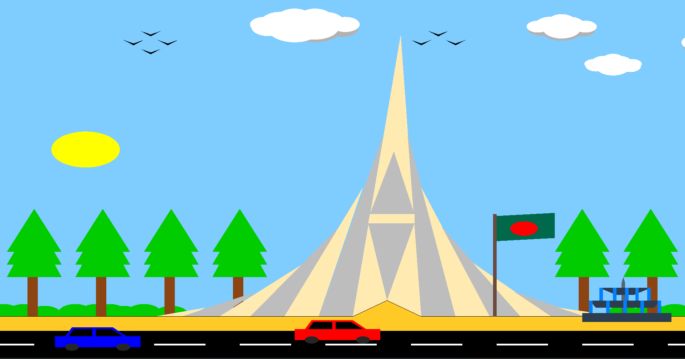
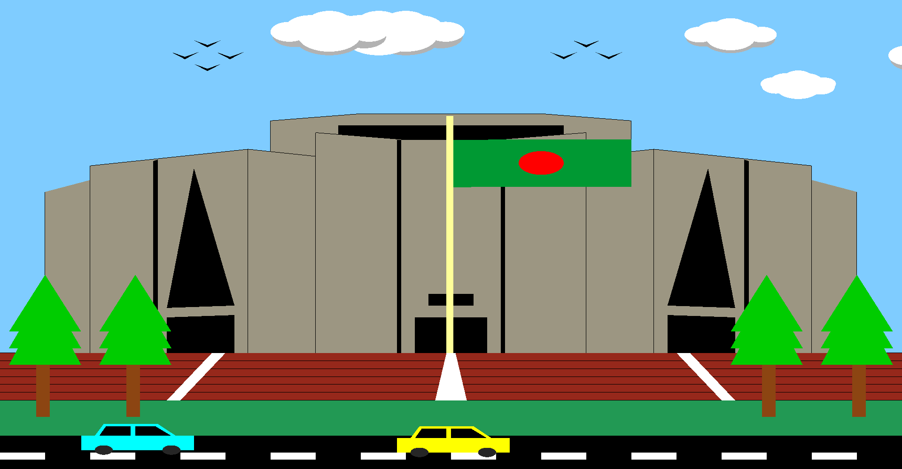
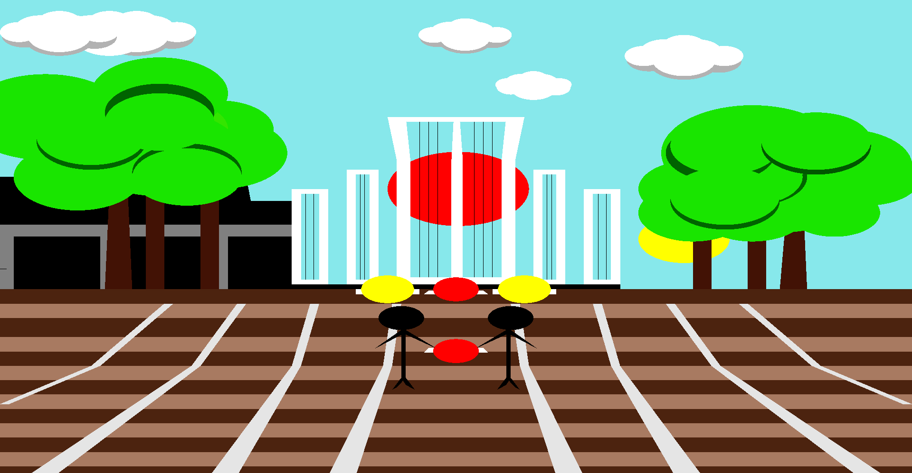

# OpenGL-Three-Scenario

- **Scenario 1:**
  
  

- **Scenario 2:**
  
  

- **Scenario 3:**
  
  

## Authors
- [**Sad Bin Siddique**](https://github.com/sadbinsiddique)
- [**Md Jannatun Naim**](https://github.com/mdjn)
- [**Tarif-ul-Haider Rabbi**](https://github.com/tarifrabbi)
- [**S. F. Sheikh Saadi**](https://github.com/sheikhsaadi)
- [**Mir Md. Shakib Munna**](https://github.com/mirshakibmunna)

## Overview
This project is an interactive graphical simulation built using OpenGL. It includes three distinct scenarios, each offering a dynamic and engaging visual experience. The application features day-night transitions, animation speed controls, and interactive sound elements to provide an immersive user experience.

## Key Features
- **Day-Night Cycle:** Toggle between day and night settings using the Up and Down arrow keys.
- **Animation Speed Control:** Adjust the speed of animations dynamically with the Left and Right arrow keys.
- **Interactive Scenarios:**
  - **Scenario 1:** Depicts a vibrant outdoor scene with moving clouds, animated objects, and environmental elements.
  - **Scenario 2:** Features dynamic elements such as vehicles and moving water, enhancing the realism of the landscape.
  - **Scenario 3:** Focuses on an urban or specialized environment, showcasing additional animations and interactive components.
- **Audio Integration:** Background sounds enhance the user experience, with specific sounds activated or switched during runtime.

## Navigation and Controls
- **Cover Page:** Press `0` to return to the cover page.
- **Switching Scenarios & sounds:** Use keys `1`, `2`, and `3` to navigate to the first, second, and third scenarios, respectively.
- **Day-Night Toggle:**
  - Press `Up Arrow` for day mode.
  - Press `Down Arrow` for night mode.
- **Animation Speed:**
  - Press `Left Arrow` to slow down animations.
  - Press `Right Arrow` to speed up animations.
- **Exit:** Press `Esc` to exit the application.

## How to Run
1. Make sure you have OpenGL installed on your system.
2. Compile the source code using an appropriate compiler (e.g., GCC, MSVC).
3. Run the executable file generated to start the simulation.

## Requirements
- OpenGL library
- Compatible C++ compiler

## Summary
"OpenGL Three Scenario" is a creative and educational project that demonstrates the power of OpenGL for interactive graphical applications. Combining animation, interactivity, and sound, it provides an engaging platform for exploring graphical programming and design.
